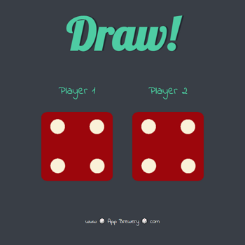

# London App Brewery - Dicee Game

This is a solution to the [Dicee Game](https://www.udemy.com/course/the-complete-web-development-bootcamp/learn/lecture/12383900) challenge on [Udemy](https://www.udemy.com/course/the-complete-web-development-bootcamp/).

## Table of contents

- [Overview](#overview)
  - [The challenge](#the-challenge)
  - [Screenshot](#screenshot)
  - [Links](#links)
- [My process](#my-process)
  - [Built with](#built-with)
  - [How to install and run](#how-to-install-and-run)
- [Author](#author)

## Overview

### The challenge

"You're going to be using all of that knowledge that we learned about the DOM and JavaScript to create our very own dice game."

### Screenshot



### Links

- Code URL: [Github](https://github.com/cekstedt/LAB-Dicee-Game)
- Live Site URL: [Netlify](https://glittery-truffle-cdf308.netlify.app/)
- Challenge URL: [Udemy](https://www.udemy.com/course/the-complete-web-development-bootcamp/learn/lecture/12383900)

## My process

### Built with

- HTML
- CSS
- JS

### How to install and run

First clone the repo and navigate into the directory.
```
git clone https://github.com/cekstedt/LAB-Dicee-Game.git
cd LAB-Dicee-Game/
```

This project contains javascript, so you must start a local web server to see it function. The following options will expose your `src/` folder to http://localhost:8000/ via Python or NodeJS, respectively.

```
python -m http.server 8000 -d ./src
```

```
npx http-server ./src -p 8000
```


## Author

- [@cekstedt](https://github.com/cekstedt)
